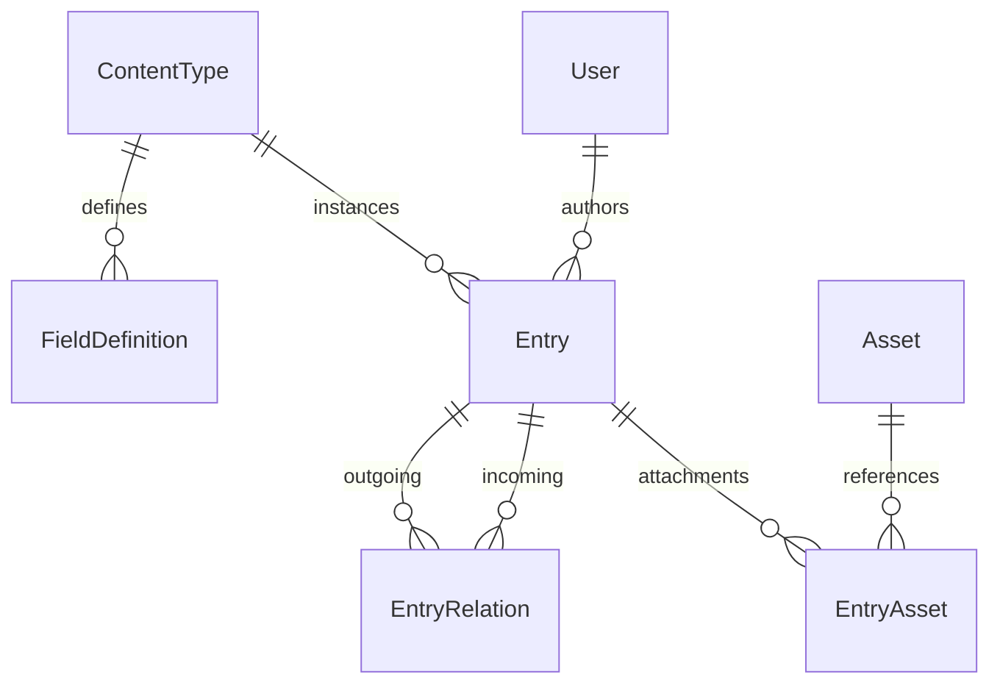
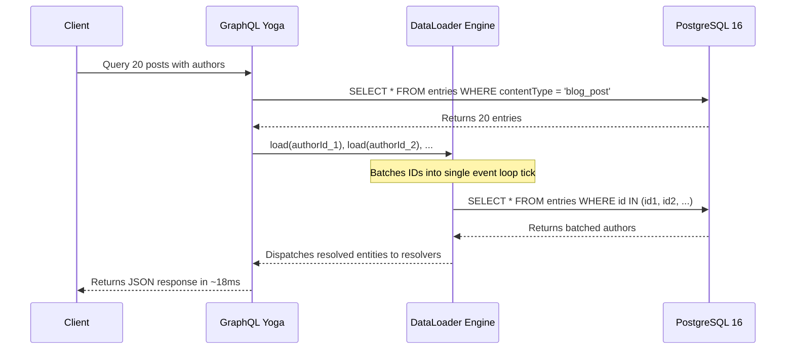

# 🏛️ Headless CMS Architecture Specification

This document provides a technical deep-dive into the architectural decisions, database modeling, execution pipelines, and security mechanisms powering the Custom Headless CMS backend.

---

## 1. Storage Layer: Dynamic Content Modeling

### The Architectural Dilemma: EAV vs DDL vs JSONB
Standard CMS systems typically employ one of three strategies for runtime schemas:
1. **Entity-Attribute-Value (EAV)**: Normalizes data into rows (`entity_id`, `attribute_id`, `value`). Suffers from severe query complexity, joining overhead, and slow performance on deep graph traversal.
2. **Dynamic DDL (`ALTER TABLE`)**: Executes SQL `ADD COLUMN` on the fly. Dangerous in production due to table locking, schema fragmentation, and database migration risks.
3. **Hybrid JSONB + Relational Junction (Our Solution)**:
   - Dynamic user-defined field values are stored within an indexed PostgreSQL `JsonB` column (`Entry.data`).
   - The CMS validates incoming records against the `FieldDefinition` model before writing.
   - Relational links (`EntryRelation`) and media assets (`EntryAsset`) are stored in explicit indexed join tables, preserving relational integrity and enabling fast joins.

---

## 2. Delivery Layer: GraphQL Yoga & DataLoader

### Solving the N+1 Query Problem
When querying 20 blog posts, resolving each author individually triggers 20 subsequent SQL lookups ($1 + 20 = 21$ queries).

---

## 3. Security & Dual-Vector RBAC

1. **Interactive Administration (JWT)**:
   - Admin and Editor users authenticate via `mutation { login(...) }`.
   - Issues a cryptographically signed HMAC-SHA256 JWT valid for 7 days.
2. **Decoupled Client Delivery (API Keys)**:
   - Frontend applications authenticate via `x-api-key: cms_<random_hex>`.
   - Keys are stored in the database exclusively as irreversible SHA-256 hashes (`keyHash`), preventing plain-text credential leaks if the database is dumped.
   - Consumer keys are restricted to read-only access on `PUBLISHED` content.

---

## 4. Production Hardening Checklist
- [x] Strict TypeScript configuration with zero implicit `any`.
- [x] Multi-stage containerization via `Dockerfile` and `docker-compose.yml`.
- [x] Graceful shutdown handling (`onClose` hooks closing database connection pools).
- [x] Live database latency monitoring probe on `/health`.
- [x] Automated end-to-end integration test suite (`test/e2e.ts`).
